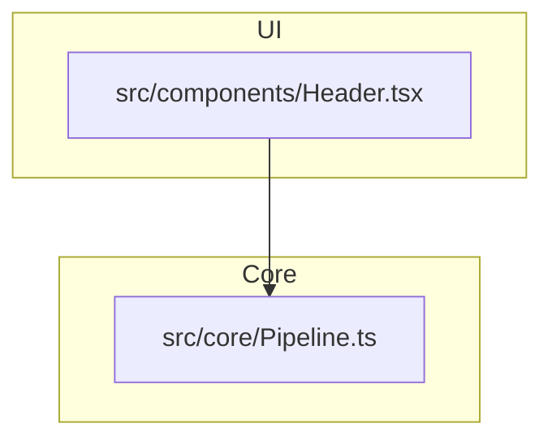

<!--
Snapshot Generated by ctxr
Project: architecture-diagram-generator
Version: 0.4.16
Stack: commander, glob, ts-morph, typescript, zod
Date: 2026-05-03T04:19:01.368Z
-->

## Project Insights
| Metric | Value |
|---|---|
| **Health Score** | **5/10** (🟡 Needs Attention) |\n| Last Commit | 2026-05-03 01:07:06 -0300 |\n| Total Commits | 87 |\n| Branches | * main |\n| Repo Size | 123M |\n| Lockfile Age | 2026-05-03T04:04:01.785Z |

---

## File: README.md

```markdown
# Architecture Diagram Generator (v0.4.16)

Automated architecture visualization for TypeScript and Next.js projects. Scan your codebase, classify layers, and generate interactive dashboards.


> [!TIP]
> **New in v0.4.16:** Interactive SVG output with semantic layering and dark mode support.

## CLI + Programmatic API
This package works as both a standalone CLI tool for quick documentation and a robust library for custom automation pipelines.

---

## Configuration

Create an `architecture-config.json` in your project root to customize layer detection and filtering.

```json
{
  "layers": {
    "UI": ["src/components", "src/pages"],
    "API": ["src/app/api", "src/pages/api"],
    "Core": ["src/core", "src/logic"],
    "External": ["node_modules"]
  },
  "exclude": ["**/*.test.ts", "**/dist/**"]
}
```

---

## Usage

### CLI (via npx)
Generate all formats (JSON, MD, HTML, SVG) in one command:
```bash
npx architecture-generator . -o architecture.json
```

### Library
```typescript
import { ArchitecturePipeline } from 'architecture-diagram-generator';

const pipeline = new ArchitecturePipeline({
  version: '0.4.16',
  rootDir: process.cwd(),
  outputBase: 'architecture.json'
});

const result = await pipeline.runFull('.');
console.log('Graph generated:', result.graph.nodes.length, 'nodes');
```

---

## What it detects

The generator uses static analysis (AST) to detect complex patterns:

- **External Services**: Identifies usage of `axios`, `fetch`, `prisma`, `stripe`, etc.
- **Database Calls**: Detects repository patterns and direct DB access.
- **Type-only Imports**: Differentiates between runtime dependencies and type-only imports (rendered as dashed lines).
- **Layer Violations**: Identifies when a Core module imports from the UI layer.

---

## Generated Output Example

### architecture.md (Mermaid)


### architecture.svg
Interactive, standalone SVG with:
- **Bottom-up layering**: Semantic vertical organization.
- **Click-to-Source**: Nodes link directly to your local files.
- **Dark Mode**: Automatic theme switching via CSS variables.

---

## License
MIT

```

---

## File: architecture.md

```markdown
# Architecture Diagram

```mermaid
flowchart TD
  subgraph Core ["Core"]
      src_cli_ts["📦 Cli"]
      src_index_ts["📦 Src / Index"]
    subgraph Core_core ["core"]
      src_core_ArchitectureClassifier_ts["📦 ArchitectureClassifier"]
      src_core_ArchitectureFilter_ts["📦 ArchitectureFilter"]
      src_core_ArchitecturePipeline_ts["📦 ArchitecturePipeline"]
      src_core_ConfigurationLoader_ts["📦 ConfigurationLoader"]
      src_core_ConfigValidator_ts["📦 ConfigValidator"]
      src_core_DependencyGraph_ts["📦 DependencyGraph"]
      src_core_DependencyGraphBuilder_ts["📦 DependencyGraphBuilder"]
      src_core_FileDiscovery_ts["📦 FileDiscovery"]
      src_core_GraphTypes_ts["📦 GraphTypes"]
      src_core_index_ts["📦 Src / Core / Index"]
      src_core_MetadataGenerator_ts["📦 MetadataGenerator"]
      src_core_ModuleCache_ts["📦 ModuleCache"]
      src_core_Normalizer_ts["📦 Normalizer"]
      src_core_OutputTypes_ts["📦 OutputTypes"]
      src_core_ParallelFileProcessor_ts["📦 ParallelFileProcessor"]
    end
    subgraph Core_generators ["generators"]
      src_generators_D3Renderer_ts["📦 D3Renderer"]
      src_generators_DiagramGenerator_ts["📦 DiagramGenerator"]
      src_generators_HTMLGenerator_ts["📦 HTMLGenerator"]
      src_generators_index_ts["📦 Src / Generators / Index"]
      src_generators_MermaidRenderer_ts["📦 MermaidRenderer"]
      src_generators_SVGRenderer_ts["📦 SVGRenderer"]
      src_generators_types_ts["📦 Types"]
      src_generators_VisualMapper_ts["📦 VisualMapper"]
    end
    subgraph Core_parsers ["parsers"]
      src_parsers_ASTParser_ts["📦 ASTParser"]
      src_parsers_index_ts["📦 Src / Parsers / Index"]
      src_parsers_MermaidParser_ts["📦 MermaidParser"]
    end
    subgraph Core_utils ["utils"]
      src_utils_errors_ts["📦 Errors"]
      src_utils_index_ts["📦 Src / Utils / Index"]
      src_utils_logger_ts["📦 Logger"]
      src_utils_OutputWriter_ts["📦 OutputWriter"]
    end
  end
  subgraph External ["External"]
      commander[( "☁️ commander" )]
      crypto[( "☁️ crypto" )]
      dbNames[( "☁️ dbNames" )]
      dbPatterns[( "☁️ dbPatterns" )]
      fs_promises[( "☁️ fs/promises" )]
      glob[( "☁️ glob" )]
      path[( "☁️ path" )]
      ts_morph[( "☁️ ts-morph" )]
      typescript[( "☁️ typescript" )]
      zod[( "☁️ zod" )]
  end
  src_cli_ts --> commander
  src_cli_ts --> path
  src_cli_ts --> src_core_ArchitecturePipeline_ts
  src_core_ArchitectureClassifier_ts --> src_core_ConfigValidator_ts
  src_core_ArchitectureClassifier_ts --> src_core_GraphTypes_ts
  src_core_ArchitectureFilter_ts --> src_core_DependencyGraph_ts
  src_core_ArchitecturePipeline_ts --> fs_promises
  src_core_ArchitecturePipeline_ts --> path
  src_core_ArchitecturePipeline_ts --> src_core_ArchitectureClassifier_ts
  src_core_ArchitecturePipeline_ts --> src_core_ConfigValidator_ts
  src_core_ArchitecturePipeline_ts --> src_core_DependencyGraphBuilder_ts
  src_core_ArchitecturePipeline_ts --> src_core_FileDiscovery_ts
  src_core_ArchitecturePipeline_ts --> src_core_GraphTypes_ts
  src_core_ArchitecturePipeline_ts --> src_core_Normalizer_ts
  src_core_ArchitecturePipeline_ts --> src_generators_DiagramGenerator_ts
  src_core_ArchitecturePipeline_ts --> src_generators_HTMLGenerator_ts
  src_core_ArchitecturePipeline_ts --> src_generators_SVGRenderer_ts
  src_core_ArchitecturePipeline_ts --> src_parsers_ASTParser_ts
  src_core_ConfigurationLoader_ts --> fs_promises
  src_core_ConfigurationLoader_ts --> path
  src_core_ConfigValidator_ts --> zod
  src_core_DependencyGraph_ts --> src_core_GraphTypes_ts
  src_core_DependencyGraphBuilder_ts --> path
  src_core_DependencyGraphBuilder_ts --> src_core_DependencyGraph_ts
  src_core_DependencyGraphBuilder_ts --> src_core_GraphTypes_ts
  src_core_FileDiscovery_ts --> fs_promises
  src_core_FileDiscovery_ts --> glob
  src_core_FileDiscovery_ts --> path
  src_core_FileDiscovery_ts --> src_utils_errors_ts
  src_core_index_ts --> src_core_ArchitectureClassifier_ts
  src_core_index_ts --> src_core_ArchitectureFilter_ts
  src_core_index_ts --> src_core_ArchitecturePipeline_ts
  src_core_index_ts --> src_core_ConfigurationLoader_ts
  src_core_index_ts --> src_core_ConfigValidator_ts
  src_core_index_ts --> src_core_DependencyGraph_ts
  src_core_index_ts --> src_core_DependencyGraphBuilder_ts
  src_core_index_ts --> src_core_FileDiscovery_ts
  src_core_index_ts --> src_core_GraphTypes_ts
  src_core_index_ts --> src_core_MetadataGenerator_ts
  src_core_index_ts --> src_core_ModuleCache_ts
  src_core_index_ts --> src_core_Normalizer_ts
  src_core_index_ts --> src_core_OutputTypes_ts
  src_core_index_ts --> src_core_ParallelFileProcessor_ts
  src_core_MetadataGenerator_ts --> fs_promises
  src_core_MetadataGenerator_ts --> path
  src_core_MetadataGenerator_ts --> src_core_ArchitectureClassifier_ts
  src_core_MetadataGenerator_ts --> src_core_DependencyGraph_ts
  src_core_ModuleCache_ts --> crypto
  src_core_ModuleCache_ts --> fs_promises
  src_core_ModuleCache_ts --> path
  src_core_Normalizer_ts --> path
  src_core_Normalizer_ts --> src_core_GraphTypes_ts
  src_core_OutputTypes_ts --> src_core_GraphTypes_ts
  src_core_ParallelFileProcessor_ts --> src_core_ModuleCache_ts
  src_generators_D3Renderer_ts --> src_generators_types_ts
  src_generators_DiagramGenerator_ts --> src_core_GraphTypes_ts
  src_generators_DiagramGenerator_ts --> src_generators_MermaidRenderer_ts
  src_generators_DiagramGenerator_ts --> src_generators_VisualMapper_ts
  src_generators_HTMLGenerator_ts --> src_generators_D3Renderer_ts
  src_generators_HTMLGenerator_ts --> src_generators_types_ts
  src_generators_index_ts --> src_generators_DiagramGenerator_ts
  src_generators_index_ts --> src_generators_HTMLGenerator_ts
  src_generators_index_ts --> src_generators_SVGRenderer_ts
  src_generators_index_ts --> src_generators_VisualMapper_ts
  src_generators_MermaidRenderer_ts --> src_core_GraphTypes_ts
  src_generators_MermaidRenderer_ts --> src_generators_VisualMapper_ts
  src_generators_SVGRenderer_ts --> src_generators_types_ts
  src_generators_VisualMapper_ts --> src_core_GraphTypes_ts
  src_index_ts --> src_generators_DiagramGenerator_ts
  src_index_ts --> src_generators_HTMLGenerator_ts
  src_index_ts --> src_generators_MermaidRenderer_ts
  src_index_ts --> src_generators_VisualMapper_ts
  src_index_ts --> src_parsers_ASTParser_ts
  src_index_ts --> src_parsers_MermaidParser_ts
  src_parsers_ASTParser_ts --> dbNames
  src_parsers_ASTParser_ts --> dbPatterns
  src_parsers_ASTParser_ts --> path
  src_parsers_ASTParser_ts --> src_core_ModuleCache_ts
  src_parsers_ASTParser_ts --> src_utils_errors_ts
  src_parsers_ASTParser_ts --> ts_morph
  src_parsers_ASTParser_ts --> typescript
  src_parsers_index_ts --> src_parsers_ASTParser_ts
  src_parsers_index_ts --> src_parsers_MermaidParser_ts
  src_utils_index_ts --> src_utils_errors_ts
  src_utils_index_ts --> src_utils_logger_ts
  src_utils_index_ts --> src_utils_OutputWriter_ts
  src_utils_OutputWriter_ts --> fs_promises
  src_utils_OutputWriter_ts --> path
  src_utils_OutputWriter_ts --> src_utils_errors_ts

```
```

---

## File: backlog-ts-morph.md

```markdown
# Backlog: ts-morph Integration & Schema Enrichment

## Goal
- **Target Version**: `0.3.0`
- **Objective**: Replace raw TypeScript Compiler API with `ts-morph` to enable semantic analysis and enriched architectural metadata.

## Phase 1: Infrastructure & Setup (Performance Optimized)
- [x] Install `ts-morph` and its dependencies in `architecture-diagram-generator`.
- [x] Implement `Project` Singleton logic in `ASTParser` to reuse the TypeScript program.
- [x] Implement `tsconfig.json` resolution with graceful fallback for projects without it.
- [x] Update `ModuleCache` logic to handle engine migration (cache invalidation).

## Phase 2: Core Refactor (Semantic Analysis)
- [x] Refactor `extractImports` & `extractExports` using `ts-morph` API.
- [x] Implement detection of Type-only imports vs. Runtime imports.
- [x] Refactor `detectExternalCalls` to use the `TypeChecker` for high-precision identification (Prisma, Axios, etc.).

## Phase 3: Metadata Enrichment (Enriched Graph)
- [x] Implement inheritance extraction (`extends`/`implements`) to map class hierarchies.
- [x] Implement Decorator extraction (e.g., `@Injectable`, `@Controller`) for automated classification.
- [x] Implement SLOC and Cyclomatic Complexity metrics per module.
- [x] Add `typeOnly` flag to dependency edges in the JSON graph.

## Phase 4: Contract Alignment & Documentation
- [x] Document the new `architecture.json` schema (v0.3.0) with the new metadata fields.
- [x] Define the impact of `inheritance` and `typeOnly` on existing stability and coupling metrics.
- [x] Create a "Contract Change" report to guide the `architecture-analyzer` update.

## Phase 5: Architecture Analyzer Update
- [x] Update types/interfaces in `architecture-analyzer` to match the new schema.
- [x] Implement inheritance-based rules (e.g., "Domain should not extend Infrastructure").
- [x] Update circular dependency detection to optionally ignore `type-only` imports.
- [x] Implement complexity-based linting rules.

## Phase 6: Validation & Quality
- [x] Migrate existing integration tests to verify parser parity/accuracy.
- [x] Benchmark performance (Memory usage and Parse time) comparison.
- [x] Update documentation with the new metadata specification.

```

---

## File: package.json

```json
{
  "name": "architecture-diagram-generator",
  "version": "0.4.16",
  "description": "Automated Architecture Diagram Generator (v0.4.16) for Next.js projects. Scan codebases, classify layers, and generate interactive HTML dashboards and Mermaid diagrams.",
  "main": "dist/index.js",
  "types": "dist/index.d.ts",
  "bin": {
    "architecture-generator": "dist/cli.js"
  },
  "scripts": {
    "build": "tsc",
    "prepublishOnly": "npm run build",
    "dev": "tsc --watch",
    "diagram": "node dist/cli.js",
    "test": "vitest --run",
    "test:watch": "vitest",
    "lint": "eslint src/**/*.ts",
    "analyze": "node dist/cli.js",
    "prepare": "husky"
  },
  "dependencies": {
    "commander": "^12.0.0",
    "glob": "^13.0.0",
    "ts-morph": "^28.0.0",
    "typescript": "^5.3.3",
    "zod": "^4.3.6"
  },
  "devDependencies": {
    "@types/node": "^20.19.39",
    "@typescript-eslint/eslint-plugin": "^8.59.0",
    "@typescript-eslint/parser": "^8.59.0",
    "@vitest/ui": "^1.0.4",
    "eslint": "^8.57.1",
    "fast-check": "^4.7.0",
    "husky": "^9.0.0",
    "lint-staged": "^16.4.0",
    "vitest": "^1.0.4"
  },
  "keywords": [
    "typescript",
    "ts-morph",
    "dependency-graph",
    "static-analysis",
    "ast",
    "codebase-visualization",
    "cli"
  ],
  "engines": {
    "node": ">=18.0.0"
  },
  "author": "chavito",
  "license": "MIT",
  "repository": {
    "type": "git",
    "url": "git+https://github.com/chachachavito/architecture-diagram-generator.git"
  },
  "bugs": {
    "url": "https://github.com/chachachavito/architecture-diagram-generator/issues"
  },
  "homepage": "https://github.com/chachachavito/architecture-diagram-generator#readme",
  "files": [
    "dist",
    "README.md",
    "LICENSE",
    "architecture-config.example.json"
  ],
  "lint-staged": {
    "src/**/*.ts": [
      "eslint --fix",
      "vitest related --run"
    ]
  }
}

```

---

