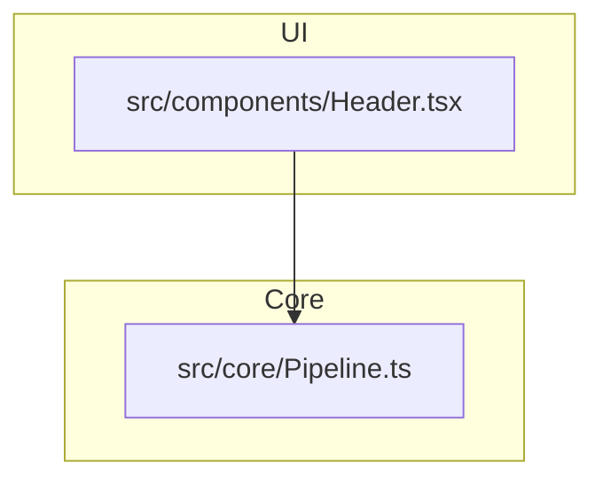

# Architecture Diagram Generator (v0.4.16)

Automated architecture visualization for TypeScript and Next.js projects. Scan your codebase, classify layers, and generate interactive dashboards.


> [!TIP]
> **New in v0.4.16:** Interactive SVG output with semantic layering and dark mode support.

## CLI + Programmatic API
This package works as both a standalone CLI tool for quick documentation and a robust library for custom automation pipelines.

---

## Configuration

Create an `architecture-config.json` in your project root to customize layer detection and filtering.

```json
{
  "layers": {
    "UI": ["src/components", "src/pages"],
    "API": ["src/app/api", "src/pages/api"],
    "Core": ["src/core", "src/logic"],
    "External": ["node_modules"]
  },
  "exclude": ["**/*.test.ts", "**/dist/**"]
}
```

---

## Usage

### CLI (via npx)
Generate all formats (JSON, MD, HTML, SVG) in one command:
```bash
npx architecture-generator . -o architecture.json
```

### Library
```typescript
import { ArchitecturePipeline } from 'architecture-diagram-generator';

const pipeline = new ArchitecturePipeline({
  version: '0.4.16',
  rootDir: process.cwd(),
  outputBase: 'architecture.json'
});

const result = await pipeline.runFull('.');
console.log('Graph generated:', result.graph.nodes.length, 'nodes');
```

---

## What it detects

The generator uses static analysis (AST) to detect complex patterns:

- **External Services**: Identifies usage of `axios`, `fetch`, `prisma`, `stripe`, etc.
- **Database Calls**: Detects repository patterns and direct DB access.
- **Type-only Imports**: Differentiates between runtime dependencies and type-only imports (rendered as dashed lines).
- **Layer Violations**: Identifies when a Core module imports from the UI layer.

---

## Generated Output Example

### architecture.md (Mermaid)


### architecture.svg
Interactive, standalone SVG with:
- **Bottom-up layering**: Semantic vertical organization.
- **Click-to-Source**: Nodes link directly to your local files.
- **Dark Mode**: Automatic theme switching via CSS variables.

---

## License
MIT
