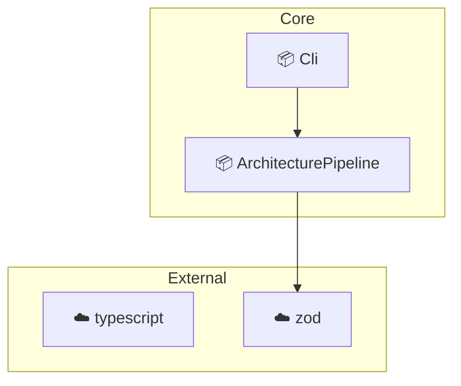

# [Architecture Diagram Generator](https://www.npmjs.com/package/architecture-diagram-generator)

**Map your TypeScript architecture in seconds.**
No configuration required for most projects.

[](https://www.npmjs.com/package/architecture-diagram-generator)
[](https://www.npmjs.com/package/architecture-diagram-generator)
[](https://github.com/chachachavito/architecture-diagram-generator/blob/main/LICENSE)

## Who is this for?

- **Architects & Tech Leads**: To maintain a living record of the system architecture
- **Developers**: To quickly visualize the topology of unfamiliar repositories

## Quick Start

Run in any TypeScript project (no setup required):
```bash
npx architecture-diagram-generator .
```
Runs in seconds

Outputs are generated in the project root

CLI output:
```text
✔ architecture.md created
✔ architecture.json created
```

## Example Output



## Artifacts

- **`architecture.json`**: Dependency graph
- **`architecture.md`**: Mermaid diagram

## Automated Governance Pipeline

Use the JSON output for automated validation:

1. **Extract**: `architecture-diagram-generator` — Generates the graph
2. **Audit**: [architecture-analyzer](https://github.com/chachachavito/architecture-analyzer) — Validates rules and detects issues

## Supported Environments

- Next.js (App/Pages router)
- Layered Architectures (Core, Domain, Infra)
- Monorepos (pnpm, yarn workspaces)

For custom layouts, use an `architecture-config.json` in the root.

## Limitations

- **Convention-based**: Relies on standard folder naming and import patterns
- **TypeScript ecosystem**: Supports .ts and .tsx only

## Call to Action

Run locally or in CI to keep your architecture in sync.

---
MIT License • Created by [chachachavito](https://github.com/chachachavito)
