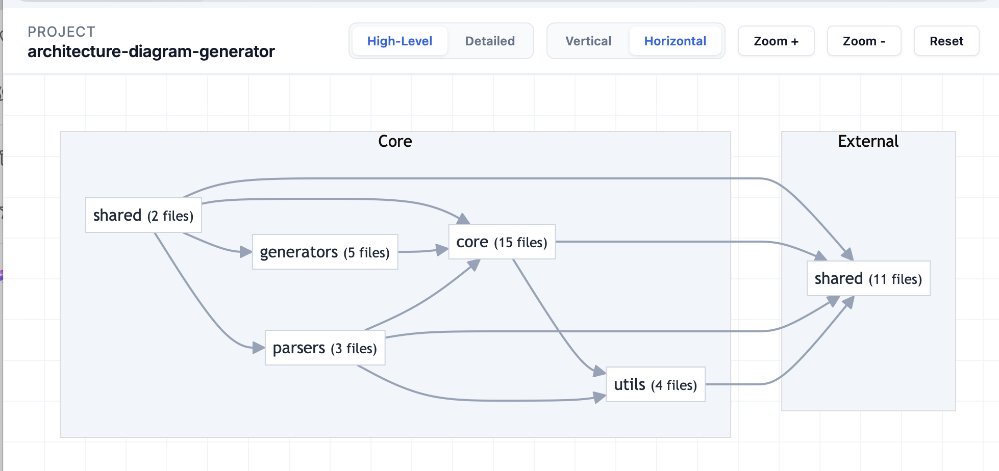

# Architecture Diagram Generator (v0.4.13)


*Interactive Dashboard with drill-down capabilities*


*Static architecture overview*

**Understand your TypeScript architecture in seconds.**
Automated dependency analysis and interactive visualization for modern web projects.

## Overview

Architecture Diagram Generator is a zero-config tool that transforms your codebase into a high-fidelity interactive dashboard. It performs deep semantic analysis using **ts-morph** to map connections, external integrations, and architectural layers.

## Key Features

- **Interactive HTML Dashboard**: Premium visualization with drill-down capabilities (click on domains to see internal files).
- **Automated Layer Classification**: Intelligently categorizes modules into UI, API, and Core layers.
- **Deep Semantic Analysis**: Detects real imports, dynamic calls, and external service integrations (fetch, axios, databases).
- **Mermaid.js Integration**: Generates deterministic Mermaid syntax for Git documentation.
- **Zero Configuration**: Works out of the box for most Next.js and TypeScript projects.

## Installation

```bash
npm install -g architecture-diagram-generator
```

## Usage

Run the generator in your project root:

```bash
architecture-generator .
```

### Output Files

- `architecture.html`: Interactive premium dashboard (Open in browser).
- `architecture.md`: Static Mermaid diagram for GitHub/GitLab.
- `architecture.json`: Raw dependency graph data for programmatic use.

## Configuration

Custom rules can be defined in `architecture-config.json`:

```json
{
  "rootDir": "./src",
  "exclude": ["**/*.test.ts", "**/node_modules/**"],
  "layers": {
    "UI": ["**/components/**"],
    "API": ["**/api/**"],
    "Core": ["**/services/**", "**/utils/**"]
  }
}
```

## Development

```bash
npm install
npm run build
npm run diagram # Test in current directory
```

## License

MIT
