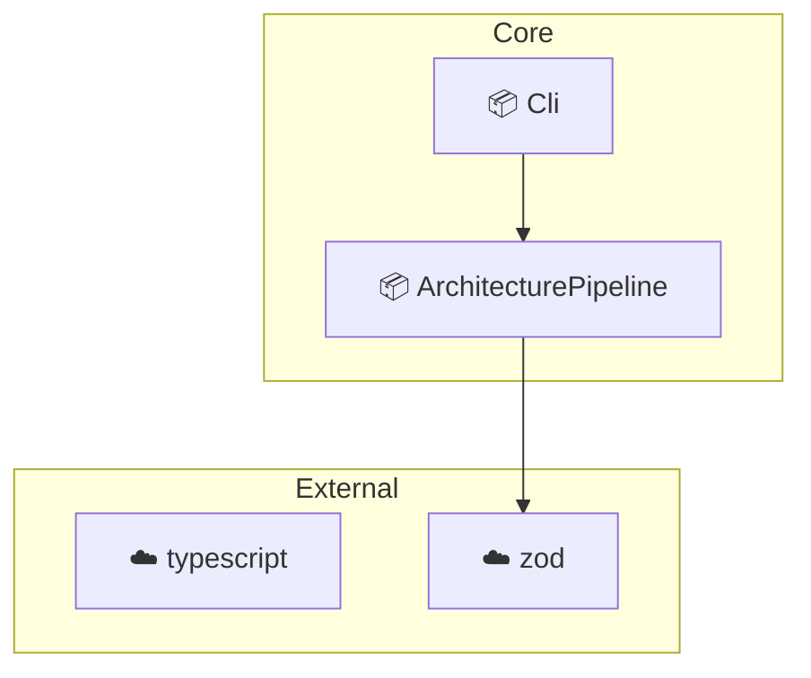

# [Architecture Diagram Generator](https://www.npmjs.com/package/architecture-diagram-generator)

**Understand your TypeScript architecture in seconds.**
No configuration required for most projects.

[](https://www.npmjs.com/package/architecture-diagram-generator)
[](https://www.npmjs.com/package/architecture-diagram-generator)
[](https://github.com/chavitochavito/architecture-diagram-generator/blob/main/LICENSE)

## Who is this for?

- **Architects & Tech Leads**: To maintain a living record of the system architecture
- **Developers**: To quickly visualize the topology of unfamiliar repositories

## Quick Start

Run in any TypeScript project (no setup required):
```bash
npx architecture-diagram-generator .
```
Runs in seconds

Outputs are generated in the project root

CLI output:
```text
✔ architecture.md created
✔ architecture.json created
✔ architecture.html created (Interactive!)
```

## Example Output



## Core Engine (v0.3.4)

Powered by **ts-morph** for deep semantic analysis.

- **Interactive HTML**: Export as a self-contained HTML page with zoom/pan support.
- **Domain Grouping**: Automatically clusters modules by domain for high readability.
- **Type-Safe Dependencies**: Distinguishes between runtime and type-only imports.
- **Inheritance Mapping**: Automatically detects `extends` and `implements` relations.
- **Code Metrics**: Provides Cyclomatic Complexity and SLOC for every module.
- **External Services**: High-precision detection of DB clients (Prisma, Mongoose) and API calls using TypeScript's TypeChecker.

## Artifacts

- **`architecture.json`**: Enriched dependency graph with metrics and inheritance data.
- **`architecture.md`**: Mermaid diagram visualizing your project structure.
- **`architecture.html`**: Premium interactive dashboard for architectural exploration.

## Automated Governance Pipeline

Use the JSON output for automated validation:

1. **Extract**: `architecture-diagram-generator` — Generates the enriched graph.
2. **Audit**: [architecture-analyzer](https://github.com/chavitochavito/architecture-analyzer) — Validates rules, inheritance, and complexity.

## Supported Environments

- Next.js (App/Pages router)
- Layered Architectures (Core, Domain, Infra)
- Monorepos (pnpm, yarn workspaces)
- NestJS & Framework-heavy projects (Decorator support)

## Limitations

- **TypeScript focus**: Optimal performance on TS/TSX projects.
- **Memory usage**: Semantic analysis requires more memory for large project graphs.

## Call to Action

Run locally or in CI to keep your architecture in sync.

---
MIT License • Created by [chavitochavito](https://github.com/chavitochavito)
