# Architecture Diagram

```mermaid
%% === AI-Generated Descriptions ===
%% src/index.ts: 
%% src/cli.ts: 
%% src/utils/logger.ts: 
%% src/utils/index.ts: 
%% src/utils/errors.ts: 
%% src/utils/OutputWriter.ts: 
%% src/plugins/index.ts: 
%% src/plugins/AIDocumentationPlugin.ts: 
%% src/parsers/index.ts: 
%% src/parsers/MermaidParser.ts: 
%% ==================================

%%{init: {"maxTextSize": 1000000}}%%
flowchart TD
  subgraph Core
    src_cli_ts["📦 Cli"]
    src_core_ArchitectureClassifier_ts["📦 ArchitectureClassifier"]
    src_core_ArchitectureFilter_ts["📦 ArchitectureFilter"]
    src_core_ArchitecturePipeline_ts["📦 ArchitecturePipeline"]
    src_core_ConfigurationLoader_ts["📦 ConfigurationLoader"]
    src_core_ConfigValidator_ts["📦 ConfigValidator"]
    src_core_DependencyGraph_ts["📦 DependencyGraph"]
    src_core_DependencyGraphBuilder_ts["📦 DependencyGraphBuilder"]
    src_core_FileDiscovery_ts["📦 FileDiscovery"]
    src_core_GraphTypes_ts["📦 GraphTypes"]
    src_core_index_ts["📦 Core/Index"]
    src_core_MetadataGenerator_ts["📦 MetadataGenerator"]
    src_core_ModuleCache_ts["📦 ModuleCache"]
    src_core_Normalizer_ts["📦 Normalizer"]
    src_core_OutputTypes_ts["📦 OutputTypes"]
    src_core_ParallelFileProcessor_ts["📦 ParallelFileProcessor"]
    src_core_PluginManager_ts["📦 PluginManager"]
    src_generators_DiagramGenerator_ts["📦 DiagramGenerator"]
    src_generators_index_ts["📦 Generators/Index"]
    src_generators_MermaidRenderer_ts["📦 MermaidRenderer"]
    src_generators_VisualExporter_ts["📦 VisualExporter"]
    src_generators_VisualMapper_ts["📦 VisualMapper"]
    src_index_ts["📦 Src/Index"]
    src_parsers_ASTParser_ts["📦 ASTParser"]
    src_parsers_index_ts["📦 Parsers/Index"]
    src_parsers_MermaidParser_ts["📦 MermaidParser"]
    src_plugins_AIDocumentationPlugin_ts["📦 AIDocumentationPlugin"]
    src_plugins_index_ts["📦 Plugins/Index"]
    src_utils_errors_ts["📦 Errors"]
    src_utils_index_ts["📦 Utils/Index"]
    src_utils_logger_ts["📦 Logger"]
    src_utils_OutputWriter_ts["📦 OutputWriter"]
  end
  subgraph External
    child_process["☁️ child_process"]
    crypto["☁️ crypto"]
    fs["☁️ fs"]
    fs_promises["☁️ fs/promises"]
    glob["☁️ glob"]
    https__api_openai_com_v1_chat_completions["☁️ https://api.openai.com/v1/chat/completions"]
    path["☁️ path"]
    puppeteer["☁️ puppeteer"]
    typescript["☁️ typescript"]
    zod["☁️ zod"]
  end
  src_cli_ts --> fs_promises
  src_cli_ts --> path
  src_core_ArchitectureClassifier_ts --> src_core_ConfigValidator_ts
  src_core_ArchitectureClassifier_ts --> src_core_GraphTypes_ts
  src_core_ArchitectureFilter_ts --> src_core_DependencyGraph_ts
  src_core_ArchitecturePipeline_ts --> src_core_ArchitectureClassifier_ts
  src_core_ArchitecturePipeline_ts --> src_core_ConfigValidator_ts
  src_core_ArchitecturePipeline_ts --> src_core_GraphTypes_ts
  src_core_ArchitecturePipeline_ts --> src_core_Normalizer_ts
  src_core_ArchitecturePipeline_ts --> src_core_PluginManager_ts
  src_core_ArchitecturePipeline_ts --> src_plugins_AIDocumentationPlugin_ts
  src_core_ConfigurationLoader_ts --> fs_promises
  src_core_ConfigurationLoader_ts --> path
  src_core_ConfigValidator_ts --> src_core_GraphTypes_ts
  src_core_ConfigValidator_ts --> zod
  src_core_DependencyGraph_ts --> src_core_GraphTypes_ts
  src_core_DependencyGraphBuilder_ts --> path
  src_core_DependencyGraphBuilder_ts --> src_core_DependencyGraph_ts
  src_core_DependencyGraphBuilder_ts --> src_core_GraphTypes_ts
  src_core_FileDiscovery_ts --> fs_promises
  src_core_FileDiscovery_ts --> glob
  src_core_FileDiscovery_ts --> path
  src_core_FileDiscovery_ts --> src_utils_errors_ts
  src_core_index_ts --> src_core_ArchitectureClassifier_ts
  src_core_index_ts --> src_core_ArchitectureFilter_ts
  src_core_index_ts --> src_core_ArchitecturePipeline_ts
  src_core_index_ts --> src_core_ConfigurationLoader_ts
  src_core_index_ts --> src_core_ConfigValidator_ts
  src_core_index_ts --> src_core_DependencyGraph_ts
  src_core_index_ts --> src_core_DependencyGraphBuilder_ts
  src_core_index_ts --> src_core_FileDiscovery_ts
  src_core_index_ts --> src_core_GraphTypes_ts
  src_core_index_ts --> src_core_MetadataGenerator_ts
  src_core_index_ts --> src_core_ModuleCache_ts
  src_core_index_ts --> src_core_Normalizer_ts
  src_core_index_ts --> src_core_OutputTypes_ts
  src_core_index_ts --> src_core_ParallelFileProcessor_ts
  src_core_index_ts --> src_core_PluginManager_ts
  src_core_MetadataGenerator_ts --> fs_promises
  src_core_MetadataGenerator_ts --> path
  src_core_MetadataGenerator_ts --> src_core_ArchitectureClassifier_ts
  src_core_MetadataGenerator_ts --> src_core_DependencyGraph_ts
  src_core_ModuleCache_ts --> crypto
  src_core_ModuleCache_ts --> fs_promises
  src_core_ModuleCache_ts --> path
  src_core_Normalizer_ts --> path
  src_core_Normalizer_ts --> src_core_GraphTypes_ts
  src_core_OutputTypes_ts --> src_core_GraphTypes_ts
  src_core_ParallelFileProcessor_ts --> src_core_ModuleCache_ts
  src_core_PluginManager_ts --> src_core_ArchitectureClassifier_ts
  src_core_PluginManager_ts --> src_core_ConfigurationLoader_ts
  src_core_PluginManager_ts --> src_core_DependencyGraph_ts
  src_core_PluginManager_ts --> src_generators_DiagramGenerator_ts
  src_core_PluginManager_ts --> src_parsers_ASTParser_ts
  src_generators_DiagramGenerator_ts --> src_core_GraphTypes_ts
  src_generators_DiagramGenerator_ts --> src_generators_MermaidRenderer_ts
  src_generators_DiagramGenerator_ts --> src_generators_VisualMapper_ts
  src_generators_index_ts --> src_generators_DiagramGenerator_ts
  src_generators_index_ts --> src_generators_VisualExporter_ts
  src_generators_MermaidRenderer_ts --> src_core_GraphTypes_ts
  src_generators_MermaidRenderer_ts --> src_generators_VisualMapper_ts
  src_generators_VisualExporter_ts --> child_process
  src_generators_VisualExporter_ts --> fs
  src_generators_VisualExporter_ts --> path
  src_generators_VisualExporter_ts --> puppeteer
  src_generators_VisualExporter_ts --> src_generators_DiagramGenerator_ts
  src_generators_VisualMapper_ts --> src_core_GraphTypes_ts
  src_index_ts --> src_generators_DiagramGenerator_ts
  src_index_ts --> src_generators_MermaidRenderer_ts
  src_index_ts --> src_generators_VisualExporter_ts
  src_index_ts --> src_generators_VisualMapper_ts
  src_index_ts --> src_parsers_ASTParser_ts
  src_index_ts --> src_parsers_MermaidParser_ts
  src_parsers_ASTParser_ts --> fs_promises
  src_parsers_ASTParser_ts --> path
  src_parsers_ASTParser_ts --> src_core_ModuleCache_ts
  src_parsers_ASTParser_ts --> src_utils_errors_ts
  src_parsers_ASTParser_ts --> typescript
  src_parsers_index_ts --> src_parsers_ASTParser_ts
  src_parsers_index_ts --> src_parsers_MermaidParser_ts
  src_plugins_AIDocumentationPlugin_ts --> https__api_openai_com_v1_chat_completions
  src_plugins_AIDocumentationPlugin_ts --> src_core_PluginManager_ts
  src_plugins_AIDocumentationPlugin_ts --> src_generators_DiagramGenerator_ts
  src_plugins_index_ts --> src_plugins_AIDocumentationPlugin_ts
  src_utils_index_ts --> src_utils_errors_ts
  src_utils_index_ts --> src_utils_logger_ts
  src_utils_index_ts --> src_utils_OutputWriter_ts
  src_utils_OutputWriter_ts --> fs_promises
  src_utils_OutputWriter_ts --> path
  src_utils_OutputWriter_ts --> src_utils_errors_ts


%% === Suggested Improvements ===
%% - Consider extracting common utilities into a shared module
%% - Review dependency direction to ensure proper layering
%% ==============================
```

## Architectural Documentation

### Recommended Improvements

- Consider extracting common utilities into a shared module
- Review dependency direction to ensure proper layering
