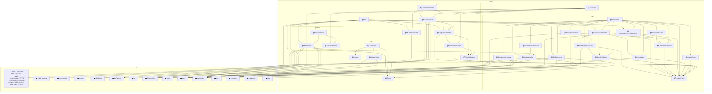

# Architecture Diagram

```mermaid
flowchart TD
  subgraph Core ["Core"]
      src_cli_ts["📦 Cli"]
      src_index_ts["📦 Src/Index"]
    subgraph Core_core ["core"]
      src_core_ArchitectureClassifier_ts["📦 ArchitectureClassifier"]
      src_core_ArchitectureFilter_ts["📦 ArchitectureFilter"]
      src_core_ArchitecturePipeline_ts["📦 ArchitecturePipeline"]
      src_core_ConfigurationLoader_ts["📦 ConfigurationLoader"]
      src_core_ConfigValidator_ts["📦 ConfigValidator"]
      src_core_DependencyGraph_ts["📦 DependencyGraph"]
      src_core_DependencyGraphBuilder_ts["📦 DependencyGraphBuilder"]
      src_core_FileDiscovery_ts["📦 FileDiscovery"]
      src_core_GraphTypes_ts["📦 GraphTypes"]
      src_core_index_ts["📦 Core/Index"]
      src_core_MetadataGenerator_ts["📦 MetadataGenerator"]
      src_core_ModuleCache_ts["📦 ModuleCache"]
      src_core_Normalizer_ts["📦 Normalizer"]
      src_core_OutputTypes_ts["📦 OutputTypes"]
      src_core_ParallelFileProcessor_ts["📦 ParallelFileProcessor"]
    end
    subgraph Core_generators ["generators"]
      src_generators_DiagramGenerator_ts["📦 DiagramGenerator"]
      src_generators_HTMLGenerator_ts["📦 HTMLGenerator"]
      src_generators_index_ts["📦 Generators/Index"]
      src_generators_MermaidRenderer_ts["📦 MermaidRenderer"]
      src_generators_VisualExporter_ts["📦 VisualExporter"]
      src_generators_VisualMapper_ts["📦 VisualMapper"]
    end
    subgraph Core_parsers ["parsers"]
      src_parsers_ASTParser_ts["📦 ASTParser"]
      src_parsers_index_ts["📦 Parsers/Index"]
      src_parsers_MermaidParser_ts["📦 MermaidParser"]
    end
    subgraph Core_utils ["utils"]
      src_utils_errors_ts["📦 Errors"]
      src_utils_index_ts["📦 Utils/Index"]
      src_utils_logger_ts["📦 Logger"]
      src_utils_OutputWriter_ts["📦 OutputWriter"]
    end
  end
  subgraph External ["External"]
      ___DOCTYPE_html___html_lang__en____head_______meta_charset__UTF_8________meta_name__viewport__content__width_device_width__initial_scale_1["☁️ `!DOCTYPE html
html lang=#quot;en#quot;
head
    meta charset=#quot;UTF-8#quot;
    meta name=#quot;viewport#quot; content=#quot;width=device-width, initial-scale=1"]
      child_process["☁️ child_process"]
      commander["☁️ commander"]
      crypto["☁️ crypto"]
      dbNames["☁️ dbNames"]
      dbPatterns["☁️ dbPatterns"]
      fs["☁️ fs"]
      fs_promises["☁️ fs/promises"]
      glob["☁️ glob"]
      path["☁️ path"]
      puppeteer["☁️ puppeteer"]
      this["☁️ this"]
      ts_morph["☁️ ts-morph"]
      typescript["☁️ typescript"]
      zod["☁️ zod"]
  end
  src_cli_ts --> commander
  src_cli_ts --> fs_promises
  src_cli_ts --> path
  src_cli_ts --> src_core_ArchitecturePipeline_ts
  src_cli_ts --> src_core_DependencyGraphBuilder_ts
  src_cli_ts --> src_core_FileDiscovery_ts
  src_cli_ts --> src_generators_DiagramGenerator_ts
  src_cli_ts --> src_generators_HTMLGenerator_ts
  src_cli_ts --> src_parsers_ASTParser_ts
  src_core_ArchitectureClassifier_ts --> src_core_ConfigValidator_ts
  src_core_ArchitectureClassifier_ts --> src_core_GraphTypes_ts
  src_core_ArchitectureClassifier_ts --> this
  src_core_ArchitectureFilter_ts --> src_core_DependencyGraph_ts
  src_core_ArchitecturePipeline_ts --> src_core_ArchitectureClassifier_ts
  src_core_ArchitecturePipeline_ts --> src_core_ConfigValidator_ts
  src_core_ArchitecturePipeline_ts --> src_core_GraphTypes_ts
  src_core_ArchitecturePipeline_ts --> src_core_Normalizer_ts
  src_core_ConfigurationLoader_ts --> fs_promises
  src_core_ConfigurationLoader_ts --> path
  src_core_ConfigValidator_ts --> src_core_GraphTypes_ts
  src_core_ConfigValidator_ts --> zod
  src_core_DependencyGraph_ts --> src_core_GraphTypes_ts
  src_core_DependencyGraphBuilder_ts --> path
  src_core_DependencyGraphBuilder_ts --> src_core_DependencyGraph_ts
  src_core_DependencyGraphBuilder_ts --> src_core_GraphTypes_ts
  src_core_FileDiscovery_ts --> fs_promises
  src_core_FileDiscovery_ts --> glob
  src_core_FileDiscovery_ts --> path
  src_core_FileDiscovery_ts --> src_utils_errors_ts
  src_core_index_ts --> src_core_ArchitectureClassifier_ts
  src_core_index_ts --> src_core_ArchitectureFilter_ts
  src_core_index_ts --> src_core_ArchitecturePipeline_ts
  src_core_index_ts --> src_core_ConfigurationLoader_ts
  src_core_index_ts --> src_core_ConfigValidator_ts
  src_core_index_ts --> src_core_DependencyGraph_ts
  src_core_index_ts --> src_core_DependencyGraphBuilder_ts
  src_core_index_ts --> src_core_FileDiscovery_ts
  src_core_index_ts --> src_core_GraphTypes_ts
  src_core_index_ts --> src_core_MetadataGenerator_ts
  src_core_index_ts --> src_core_ModuleCache_ts
  src_core_index_ts --> src_core_Normalizer_ts
  src_core_index_ts --> src_core_OutputTypes_ts
  src_core_index_ts --> src_core_ParallelFileProcessor_ts
  src_core_MetadataGenerator_ts --> fs_promises
  src_core_MetadataGenerator_ts --> path
  src_core_MetadataGenerator_ts --> src_core_ArchitectureClassifier_ts
  src_core_MetadataGenerator_ts --> src_core_DependencyGraph_ts
  src_core_ModuleCache_ts --> crypto
  src_core_ModuleCache_ts --> fs_promises
  src_core_ModuleCache_ts --> path
  src_core_Normalizer_ts --> path
  src_core_Normalizer_ts --> src_core_GraphTypes_ts
  src_core_OutputTypes_ts --> src_core_GraphTypes_ts
  src_core_ParallelFileProcessor_ts --> src_core_ModuleCache_ts
  src_generators_DiagramGenerator_ts --> src_core_GraphTypes_ts
  src_generators_DiagramGenerator_ts --> src_generators_MermaidRenderer_ts
  src_generators_DiagramGenerator_ts --> src_generators_VisualMapper_ts
  src_generators_HTMLGenerator_ts --> ___DOCTYPE_html___html_lang__en____head_______meta_charset__UTF_8________meta_name__viewport__content__width_device_width__initial_scale_1
  src_generators_index_ts --> src_generators_DiagramGenerator_ts
  src_generators_index_ts --> src_generators_HTMLGenerator_ts
  src_generators_index_ts --> src_generators_VisualExporter_ts
  src_generators_MermaidRenderer_ts --> src_core_GraphTypes_ts
  src_generators_MermaidRenderer_ts --> src_generators_VisualMapper_ts
  src_generators_VisualExporter_ts --> child_process
  src_generators_VisualExporter_ts --> fs
  src_generators_VisualExporter_ts --> path
  src_generators_VisualExporter_ts --> puppeteer
  src_generators_VisualExporter_ts --> src_generators_DiagramGenerator_ts
  src_generators_VisualMapper_ts --> src_core_GraphTypes_ts
  src_index_ts --> src_generators_DiagramGenerator_ts
  src_index_ts --> src_generators_MermaidRenderer_ts
  src_index_ts --> src_generators_VisualExporter_ts
  src_index_ts --> src_generators_VisualMapper_ts
  src_index_ts --> src_parsers_ASTParser_ts
  src_index_ts --> src_parsers_MermaidParser_ts
  src_parsers_ASTParser_ts --> dbNames
  src_parsers_ASTParser_ts --> dbPatterns
  src_parsers_ASTParser_ts --> fs_promises
  src_parsers_ASTParser_ts --> path
  src_parsers_ASTParser_ts --> src_core_ModuleCache_ts
  src_parsers_ASTParser_ts --> src_utils_errors_ts
  src_parsers_ASTParser_ts --> ts_morph
  src_parsers_ASTParser_ts --> typescript
  src_parsers_index_ts --> src_parsers_ASTParser_ts
  src_parsers_index_ts --> src_parsers_MermaidParser_ts
  src_utils_index_ts --> src_utils_errors_ts
  src_utils_index_ts --> src_utils_logger_ts
  src_utils_index_ts --> src_utils_OutputWriter_ts
  src_utils_OutputWriter_ts --> fs_promises
  src_utils_OutputWriter_ts --> path
  src_utils_OutputWriter_ts --> src_utils_errors_ts

```