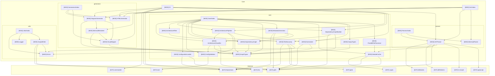

# Architecture Diagram

```mermaid
flowchart TD
  subgraph Core ["Core"]
      src_cli_ts["[MOD] Cli"]
      src_index_ts["[MOD] Src/Index"]
    subgraph Core_core ["core"]
      src_core_ArchitectureClassifier_ts["[MOD] ArchitectureClassifier"]
      src_core_ArchitectureFilter_ts["[MOD] ArchitectureFilter"]
      src_core_ArchitecturePipeline_ts["[MOD] ArchitecturePipeline"]
      src_core_ConfigurationLoader_ts["[MOD] ConfigurationLoader"]
      src_core_ConfigValidator_ts["[MOD] ConfigValidator"]
      src_core_DependencyGraph_ts["[MOD] DependencyGraph"]
      src_core_DependencyGraphBuilder_ts["[MOD] DependencyGraphBuilder"]
      src_core_FileDiscovery_ts["[MOD] FileDiscovery"]
      src_core_GraphTypes_ts["[MOD] GraphTypes"]
      src_core_index_ts["[MOD] Core/Index"]
      src_core_MetadataGenerator_ts["[MOD] MetadataGenerator"]
      src_core_ModuleCache_ts["[MOD] ModuleCache"]
      src_core_Normalizer_ts["[MOD] Normalizer"]
      src_core_OutputTypes_ts["[MOD] OutputTypes"]
      src_core_ParallelFileProcessor_ts["[MOD] ParallelFileProcessor"]
    end
    subgraph Core_generators ["generators"]
      src_generators_DiagramGenerator_ts["[MOD] DiagramGenerator"]
      src_generators_HTMLGenerator_ts["[MOD] HTMLGenerator"]
      src_generators_index_ts["[MOD] Generators/Index"]
      src_generators_MermaidRenderer_ts["[MOD] MermaidRenderer"]
      src_generators_VisualMapper_ts["[MOD] VisualMapper"]
    end
    subgraph Core_parsers ["parsers"]
      src_parsers_ASTParser_ts["[MOD] ASTParser"]
      src_parsers_index_ts["[MOD] Parsers/Index"]
      src_parsers_MermaidParser_ts["[MOD] MermaidParser"]
    end
    subgraph Core_utils ["utils"]
      src_utils_errors_ts["[MOD] Errors"]
      src_utils_index_ts["[MOD] Utils/Index"]
      src_utils_logger_ts["[MOD] Logger"]
      src_utils_OutputWriter_ts["[MOD] OutputWriter"]
    end
  end
  subgraph External ["External"]
      commander["[EXT] commander"]
      crypto["[EXT] crypto"]
      dbNames["[EXT] dbNames"]
      dbPatterns["[EXT] dbPatterns"]
      fs_promises["[EXT] fs/promises"]
      glob["[EXT] glob"]
      path["[EXT] path"]
      this["[EXT] this"]
      ts_morph["[EXT] ts-morph"]
      typescript["[EXT] typescript"]
      zod["[EXT] zod"]
  end
  src_cli_ts --> commander
  src_cli_ts --> fs_promises
  src_cli_ts --> path
  src_cli_ts --> src_core_ArchitecturePipeline_ts
  src_cli_ts --> src_core_DependencyGraphBuilder_ts
  src_cli_ts --> src_core_FileDiscovery_ts
  src_cli_ts --> src_generators_DiagramGenerator_ts
  src_cli_ts --> src_generators_HTMLGenerator_ts
  src_cli_ts --> src_parsers_ASTParser_ts
  src_core_ArchitectureClassifier_ts --> src_core_ConfigValidator_ts
  src_core_ArchitectureClassifier_ts --> src_core_GraphTypes_ts
  src_core_ArchitectureClassifier_ts --> this
  src_core_ArchitectureFilter_ts --> src_core_DependencyGraph_ts
  src_core_ArchitecturePipeline_ts --> src_core_ArchitectureClassifier_ts
  src_core_ArchitecturePipeline_ts --> src_core_ConfigValidator_ts
  src_core_ArchitecturePipeline_ts --> src_core_GraphTypes_ts
  src_core_ArchitecturePipeline_ts --> src_core_Normalizer_ts
  src_core_ConfigurationLoader_ts --> fs_promises
  src_core_ConfigurationLoader_ts --> path
  src_core_ConfigValidator_ts --> zod
  src_core_DependencyGraph_ts --> src_core_GraphTypes_ts
  src_core_DependencyGraphBuilder_ts --> path
  src_core_DependencyGraphBuilder_ts --> src_core_DependencyGraph_ts
  src_core_DependencyGraphBuilder_ts --> src_core_GraphTypes_ts
  src_core_FileDiscovery_ts --> fs_promises
  src_core_FileDiscovery_ts --> glob
  src_core_FileDiscovery_ts --> path
  src_core_FileDiscovery_ts --> src_utils_errors_ts
  src_core_index_ts --> src_core_ArchitectureClassifier_ts
  src_core_index_ts --> src_core_ArchitectureFilter_ts
  src_core_index_ts --> src_core_ArchitecturePipeline_ts
  src_core_index_ts --> src_core_ConfigurationLoader_ts
  src_core_index_ts --> src_core_ConfigValidator_ts
  src_core_index_ts --> src_core_DependencyGraph_ts
  src_core_index_ts --> src_core_DependencyGraphBuilder_ts
  src_core_index_ts --> src_core_FileDiscovery_ts
  src_core_index_ts --> src_core_GraphTypes_ts
  src_core_index_ts --> src_core_MetadataGenerator_ts
  src_core_index_ts --> src_core_ModuleCache_ts
  src_core_index_ts --> src_core_Normalizer_ts
  src_core_index_ts --> src_core_OutputTypes_ts
  src_core_index_ts --> src_core_ParallelFileProcessor_ts
  src_core_MetadataGenerator_ts --> fs_promises
  src_core_MetadataGenerator_ts --> path
  src_core_MetadataGenerator_ts --> src_core_ArchitectureClassifier_ts
  src_core_MetadataGenerator_ts --> src_core_DependencyGraph_ts
  src_core_ModuleCache_ts --> crypto
  src_core_ModuleCache_ts --> fs_promises
  src_core_ModuleCache_ts --> path
  src_core_Normalizer_ts --> path
  src_core_Normalizer_ts --> src_core_GraphTypes_ts
  src_core_OutputTypes_ts --> src_core_GraphTypes_ts
  src_core_ParallelFileProcessor_ts --> src_core_ModuleCache_ts
  src_generators_DiagramGenerator_ts --> src_core_GraphTypes_ts
  src_generators_DiagramGenerator_ts --> src_generators_MermaidRenderer_ts
  src_generators_DiagramGenerator_ts --> src_generators_VisualMapper_ts
  src_generators_index_ts --> src_generators_DiagramGenerator_ts
  src_generators_index_ts --> src_generators_HTMLGenerator_ts
  src_generators_index_ts --> src_generators_VisualMapper_ts
  src_generators_MermaidRenderer_ts --> src_core_GraphTypes_ts
  src_generators_MermaidRenderer_ts --> src_generators_VisualMapper_ts
  src_generators_VisualMapper_ts --> src_core_GraphTypes_ts
  src_index_ts --> src_generators_DiagramGenerator_ts
  src_index_ts --> src_generators_HTMLGenerator_ts
  src_index_ts --> src_generators_MermaidRenderer_ts
  src_index_ts --> src_generators_VisualMapper_ts
  src_index_ts --> src_parsers_ASTParser_ts
  src_index_ts --> src_parsers_MermaidParser_ts
  src_parsers_ASTParser_ts --> dbNames
  src_parsers_ASTParser_ts --> dbPatterns
  src_parsers_ASTParser_ts --> path
  src_parsers_ASTParser_ts --> src_core_ModuleCache_ts
  src_parsers_ASTParser_ts --> src_utils_errors_ts
  src_parsers_ASTParser_ts --> ts_morph
  src_parsers_ASTParser_ts --> typescript
  src_parsers_index_ts --> src_parsers_ASTParser_ts
  src_parsers_index_ts --> src_parsers_MermaidParser_ts
  src_utils_index_ts --> src_utils_errors_ts
  src_utils_index_ts --> src_utils_logger_ts
  src_utils_index_ts --> src_utils_OutputWriter_ts
  src_utils_OutputWriter_ts --> fs_promises
  src_utils_OutputWriter_ts --> path
  src_utils_OutputWriter_ts --> src_utils_errors_ts

```