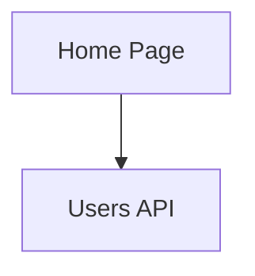

# DiagramGenerator

The `DiagramGenerator` class is responsible for generating Mermaid diagram syntax from a dependency graph. It supports various configuration options and validates the generated output.

## Features

- ✅ Generate Mermaid flowchart syntax from dependency graphs
- ✅ Support for multiple graph directions (TB, LR, BT, RL)
- ✅ Automatic node ID sanitization for Mermaid compatibility
- ✅ Custom node labels
- ✅ Toggle dependency edges on/off
- ✅ Build graphs from parsed modules
- ✅ Automatic node type inference
- ✅ Comprehensive validation

## Installation

```typescript
import { DiagramGenerator } from './src/generators';
```

## Basic Usage

### Generate from a Dependency Graph

```typescript
const generator = new DiagramGenerator();

const graph: DependencyGraph = {
  nodes: new Map([
    ['app/page.tsx', { id: 'app/page.tsx', type: 'route', label: 'Home Page' }],
    ['app/api/users/route.ts', { id: 'app/api/users/route.ts', type: 'api', label: 'Users API' }],
  ]),
  edges: [
    { from: 'app/page.tsx', to: 'app/api/users/route.ts', type: 'import' },
  ],
};

const diagram = generator.generate(graph);
console.log(diagram.syntax);
```

Output:


### Build Graph from Parsed Modules

```typescript
const generator = new DiagramGenerator();

const modules: ParsedModule[] = [
  {
    path: 'app/page.tsx',
    imports: [
      { source: 'lib/utils.ts', specifiers: ['helper'], isExternal: false },
    ],
    exports: [],
    externalCalls: [],
    metadata: {
      hasDefaultExport: true,
      isReactComponent: true,
      isApiRoute: false,
    },
  },
  {
    path: 'lib/utils.ts',
    imports: [],
    exports: [],
    externalCalls: [],
    metadata: {
      hasDefaultExport: false,
      isReactComponent: false,
      isApiRoute: false,
    },
  },
];

const graph = generator.buildGraph(modules);
const diagram = generator.generate(graph);
```

## Configuration Options

### Graph Direction

Control the flow direction of the diagram:

```typescript
// Top to Bottom (default)
generator.generate(graph, { direction: 'TB' });

// Left to Right
generator.generate(graph, { direction: 'LR' });

// Bottom to Top
generator.generate(graph, { direction: 'BT' });

// Right to Left
generator.generate(graph, { direction: 'RL' });
```

### Show/Hide Dependencies

Toggle the display of dependency edges:

```typescript
// Show dependencies (default)
generator.generate(graph, { showDependencies: true });

// Hide dependencies (nodes only)
generator.generate(graph, { showDependencies: false });
```

## API Reference

### `generate(graph, options?)`

Generates a Mermaid diagram from a dependency graph.

**Parameters:**
- `graph: DependencyGraph` - The dependency graph to visualize
- `options?: GenerationOptions` - Optional configuration
  - `direction?: 'TB' | 'LR' | 'BT' | 'RL'` - Graph direction (default: 'TB')
  - `showDependencies?: boolean` - Show dependency edges (default: true)

**Returns:** `MermaidDiagram`
- `syntax: string` - Generated Mermaid syntax
- `metadata: DiagramMetadata` - Diagram metadata

**Throws:**
- Error if graph direction is invalid
- Error if node IDs are invalid
- Error if generated syntax is malformed

### `buildGraph(modules)`

Builds a dependency graph from parsed modules.

**Parameters:**
- `modules: ParsedModule[]` - Array of parsed modules

**Returns:** `DependencyGraph`
- `nodes: Map<string, GraphNode>` - Graph nodes
- `edges: GraphEdge[]` - Graph edges

## Data Types

### DependencyGraph

```typescript
interface DependencyGraph {
  nodes: Map<string, GraphNode>;
  edges: GraphEdge[];
}
```

### GraphNode

```typescript
interface GraphNode {
  id: string;              // Unique identifier (file path)
  type: NodeType;          // Type of node
  layer?: ArchitectureLayer;
  domain?: string;
  label?: string;          // Display label for the node
}

type NodeType = 'route' | 'api' | 'component' | 'utility' | 'config' | 'external-service';
```

### GraphEdge

```typescript
interface GraphEdge {
  from: string;
  to: string;
  type: EdgeType;
}

type EdgeType = 'import' | 'external-call';
```

### MermaidDiagram

```typescript
interface MermaidDiagram {
  syntax: string;
  metadata: DiagramMetadata;
}

interface DiagramMetadata {
  nodeCount: number;
  edgeCount: number;
  generatedAt: Date;
}
```

## Validation

The DiagramGenerator performs several validation checks:

1. **Direction Validation**: Ensures graph direction is one of: TB, LR, BT, RL
2. **Node ID Validation**: Ensures all node IDs are unique and valid
3. **Syntax Validation**: Ensures generated Mermaid syntax is well-formed
   - Must start with graph declaration
   - Must have balanced brackets
   - Must contain at least one node

## Node ID Sanitization

Node IDs are automatically sanitized to be Mermaid-compatible:

- Path separators (`/`, `\`) → `_`
- Special characters → `_`
- Multiple underscores → single `_`
- Leading/trailing underscores removed
- IDs starting with numbers get `node_` prefix

Examples:
- `app/[id]/page.tsx` → `app_id_page_tsx`
- `app/(auth)/login.tsx` → `app_auth_login_tsx`
- `123-test.ts` → `node_123-test_ts`

## Label Generation

If no custom label is provided, labels are automatically generated from file paths:

- Extract filename without extension
- Convert to title case
- Replace dashes/underscores with spaces

Examples:
- `app/user-profile/page.tsx` → `Page`
- `lib/api_client.ts` → `Api Client`

## Node Type Inference

The `buildGraph()` method automatically infers node types based on file paths and metadata:

- **api**: Files in `/api/` directories or with `isApiRoute: true`
- **route**: Files in `/pages/` or named `page.tsx/page.ts`
- **component**: Files in `/component` directories or with `isReactComponent: true`
- **config**: Files with `config` or `constant` in path
- **utility**: Default for other files

## Examples

See the following files for complete examples:
- `examples/diagram-generator-usage.ts` - Comprehensive usage examples
- `test-diagram-generator.js` - Simple test script
- `test-integration.js` - Integration test with FileDiscovery and ASTParser

## Testing

Run the test suite:

```bash
npm test -- src/generators/DiagramGenerator.test.ts
```

The test suite includes:
- Basic diagram generation
- Direction validation
- Node ID validation and sanitization
- Mermaid syntax validation
- Graph building from modules
- Node type inference
- Label generation
- Metadata generation

## Requirements Satisfied

This implementation satisfies the following requirements from the spec:

- **Requirement 1.3**: Generate basic graph structure with nodes for routes and API endpoints
- **Requirement 1.5**: Generate valid Mermaid syntax with proper graph direction
- **Requirement 1.5**: Validate generated Mermaid syntax is well-formed
- **Requirement 1.5**: Ensure node IDs are unique and valid
- **Requirement 1.5**: Ensure proper graph direction (TB, LR, BT, RL)

## Next Steps

Future enhancements (Phase 2+):
- Subgraph support for layered organization
- Edge labels for import types
- Visual differentiation for external services
- Custom node shapes based on type
- Styling and theming support
