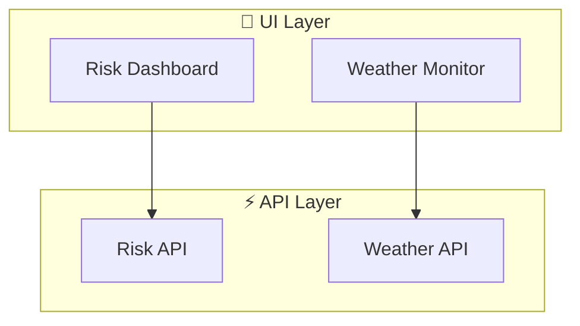

# Architecture Diagram Generator

A powerful tool for automatically generating architecture diagrams from Next.js projects. This tool analyzes your project structure, dependencies, and integrations to create visual documentation in Mermaid format.

## Features

- **Automatic Discovery**: Scans your Next.js project structure to identify routes, API endpoints, components, and utilities
- **Dependency Analysis**: Builds a complete dependency graph showing how modules connect
- **External Integration Detection**: Identifies external API calls, database connections, and third-party services
- **Intelligent Classification**: Automatically classifies modules into architectural layers (UI, API, Processing, Data)
- **Multiple Output Formats**: Generate diagrams in Markdown (Mermaid), PNG, or SVG
- **Simplified & Detailed Views**: Create high-level overviews or detailed technical diagrams
- **Plugin System**: Extend functionality with custom plugins
- **AI Integration**: Optional AI-powered documentation enhancement
- **Change Tracking**: Track architectural changes over time

## Installation

```bash
# Install dependencies
npm install

# Run the generator
npm run diagram
```

## Quick Start

### Basic Usage

Generate an architecture diagram for your project:

```bash
npm run diagram
```

This will create `docs/architecture/architecture.md` with a Mermaid diagram.

### With Options

```bash
# Generate both simplified and detailed diagrams
npm run diagram -- --simplified --detailed

# Generate PNG output
npm run diagram -- --png

# Specify output directory
npm run diagram -- --output ./my-docs

# Use a config file
npm run diagram -- --config ./architecture-config.json
```

## Configuration

Create an `architecture-config.json` file in your project root:

```json
{
  "version": "1.0.0",
  "rootDir": "./",
  "include": ["app/**", "pages/**", "src/**", "lib/**"],
  "exclude": [
    "**/*.test.ts",
    "**/*.test.tsx",
    "**/*.spec.ts",
    "**/*.stories.tsx",
    "**/node_modules/**",
    "**/.next/**"
  ],
  "layers": [
    {
      "name": "UI",
      "patterns": ["**/app/**/page.tsx", "**/pages/**", "**/components/**"],
      "color": "#3B82F6"
    },
    {
      "name": "API",
      "patterns": ["**/app/api/**", "**/pages/api/**"],
      "color": "#10B981"
    },
    {
      "name": "Processing",
      "patterns": ["**/lib/**", "**/utils/**", "**/services/**"],
      "color": "#F59E0B"
    },
    {
      "name": "Data",
      "patterns": ["**/prisma/**", "**/db/**", "**/models/**"],
      "color": "#8B5CF6"
    }
  ],
  "domains": [
    {
      "name": "Risk",
      "patterns": ["**/risk/**"],
      "critical": true
    },
    {
      "name": "Weather",
      "patterns": ["**/weather/**", "**/radar/**"]
    }
  ],
  "externalServices": [
    {
      "name": "OpenWeather API",
      "patterns": ["api.openweathermap.org"],
      "type": "REST API"
    },
    {
      "name": "PostgreSQL",
      "patterns": ["@prisma/client", "prisma"],
      "type": "Database"
    }
  ],
  "output": {
    "formats": ["markdown", "png"],
    "directory": "./docs/architecture",
    "simplified": true,
    "detailed": true
  },
  "plugins": []
}
```

### Configuration Options

| Option | Type | Description |
|--------|------|-------------|
| `version` | string | Configuration schema version (currently "1.0.0") |
| `rootDir` | string | Project root directory (default: "./") |
| `include` | string[] | Glob patterns for files to include |
| `exclude` | string[] | Glob patterns for files to exclude |
| `layers` | LayerDefinition[] | Custom layer definitions |
| `domains` | DomainDefinition[] | Domain groupings |
| `externalServices` | ExternalServiceDefinition[] | Known external services |
| `output` | OutputConfig | Output configuration |
| `plugins` | PluginConfig[] | Plugin configurations |

## CLI Options

```
Usage: npm run diagram -- [options]

Options:
  --config, -c <path>     Path to configuration file
  --output, -o <dir>      Output directory
  --simplified            Generate simplified diagram
  --detailed              Generate detailed diagram
  --png                   Generate PNG output
  --svg                   Generate SVG output
  --max-nodes <n>         Maximum nodes in simplified diagram
  --ignore <patterns>     Additional patterns to ignore
  --help, -h              Show help
```

## Output Formats

### Markdown (Mermaid)

The default output is a Markdown file with embedded Mermaid diagram:

````markdown
# Architecture Diagram


````

### PNG/SVG

For visual exports, the tool uses Mermaid CLI or Puppeteer:

```bash
npm run diagram -- --png --svg
```

## Plugin System

Extend the generator with custom plugins:

```typescript
import { Plugin, PluginHooks } from './core/PluginManager';

const myPlugin: Plugin = {
  name: 'my-custom-plugin',
  version: '1.0.0',
  hooks: {
    afterClassification: async (graph) => {
      // Custom logic after classification
      console.log(`Classified ${graph.nodes.size} nodes`);
    },
    afterGeneration: async (diagram) => {
      // Custom logic after diagram generation
    },
  },
};
```

### Available Hooks

| Hook | Description |
|------|-------------|
| `beforeDiscovery` | Called before file discovery |
| `afterParsing` | Called after AST parsing |
| `beforeClassification` | Called before architecture classification |
| `afterClassification` | Called after classification |
| `beforeGeneration` | Called before diagram generation |
| `afterGeneration` | Called after generation |

### AI Plugin

Enable AI-powered documentation enhancement:

```json
{
  "plugins": [
    {
      "name": "ai-documentation-enhancer",
      "enabled": true,
      "config": {
        "service": "openai",
        "apiKey": "${OPENAI_API_KEY}",
        "generateModuleDescriptions": true,
        "suggestImprovements": true
      }
    }
  ]
}
```

## Change Tracking

Track architectural changes over time:

```typescript
import { ChangeDetector, MetadataGenerator } from './core';

const detector = new ChangeDetector();
const changes = detector.detect(currentGraph, previousGraph);

console.log(`Added: ${changes.addedNodes.length}`);
console.log(`Removed: ${changes.removedNodes.length}`);
console.log(`Modified: ${changes.modifiedNodes.length}`);
```

## API Usage

Use the generator programmatically:

```typescript
import { 
  FileDiscovery, 
  ASTParser, 
  DependencyGraphBuilder,
  ArchitectureClassifier,
  DiagramGenerator,
  ConfigurationLoader 
} from './core';

async function generateDiagram() {
  // Load configuration
  const loader = new ConfigurationLoader();
  const config = await loader.load('./architecture-config.json');

  // Discover files
  const discovery = new FileDiscovery();
  const files = await discovery.discover(config.rootDir, config);

  // Parse files
  const parser = new ASTParser();
  const modules = await Promise.all(
    files.map(f => parser.parse(f))
  );

  // Build dependency graph
  const builder = new DependencyGraphBuilder();
  const graph = builder.build(modules);

  // Classify architecture
  const classifier = new ArchitectureClassifier();
  const classified = classifier.classify(graph, config);

  // Generate diagram
  const generator = new DiagramGenerator();
  const diagram = generator.generateDetailed(classified);

  return diagram;
}
```

## Examples

### Example 1: Basic Next.js App

```bash
# Generate diagram for a standard Next.js app
npm run diagram -- --output ./docs
```

### Example 2: Monorepo

```json
{
  "rootDir": "./packages/web-app",
  "include": ["app/**", "shared/**"],
  "exclude": ["**/node_modules/**", "**/dist/**"]
}
```

### Example 3: Custom Layers

```json
{
  "layers": [
    { "name": "Presentation", "patterns": ["**/components/**", "**/pages/**"] },
    { "name": "Business", "patterns": ["**/services/**", "**/domain/**"] },
    { "name": "Data", "patterns": ["**/repositories/**", "**/models/**"] },
    { "name": "Infrastructure", "patterns": ["**/infrastructure/**"] }
  ]
}
```

## Troubleshooting

### Diagram too large?

Use the simplified view or limit nodes:

```bash
npm run diagram -- --simplified --max-nodes 30
```

### Missing dependencies?

Make sure to include all relevant directories:

```json
{
  "include": ["app/**", "pages/**", "src/**", "lib/**", "components/**", "services/**"]
}
```

### External services not detected?

Add them to the configuration:

```json
{
  "externalServices": [
    { "name": "My API", "patterns": ["api.myservice.com"], "type": "REST API" }
  ]
}
```

## Contributing

1. Fork the repository
2. Create a feature branch
3. Make your changes
4. Run tests: `npm test`
5. Submit a pull request

## License

MIT
