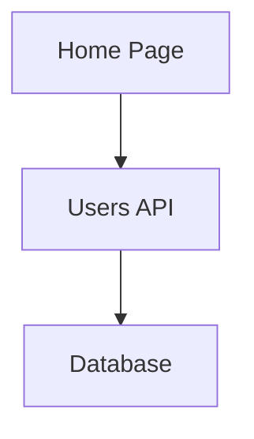

# Task 4 Implementation Summary

## Overview
Successfully implemented Task 4: **Implement basic Mermaid Diagram Generator** from the architecture-diagram-generator spec.

## Completed Subtasks

### ✅ Subtask 4.1: Create DiagramGenerator class
- Implemented `generate()` method to produce Mermaid syntax
- Generates basic graph structure with nodes for routes and API endpoints
- Uses simple node shapes (rectangles) and connections
- Supports configurable graph direction (TB, LR, BT, RL)
- **Requirements satisfied**: 1.3, 1.5

### ✅ Subtask 4.2: Implement Mermaid syntax validation
- Validates generated Mermaid syntax is well-formed
- Ensures node IDs are unique and valid
- Ensures proper graph direction (TB, LR, BT, RL)
- Validates balanced brackets and proper structure
- **Requirements satisfied**: 1.5

## Implementation Details

### Files Created
1. **src/generators/DiagramGenerator.ts** (370 lines)
   - Main DiagramGenerator class
   - Interfaces: DependencyGraph, GraphNode, GraphEdge, GenerationOptions, MermaidDiagram
   - Methods:
     - `generate()` - Generate Mermaid diagram from graph
     - `buildGraph()` - Build graph from parsed modules
     - `validateDirection()` - Validate graph direction
     - `validateNodeIds()` - Validate node IDs are unique
     - `validateMermaidSyntax()` - Validate generated syntax
     - `sanitizeNodeId()` - Sanitize IDs for Mermaid compatibility
     - `generateLabel()` - Generate human-readable labels
     - `inferNodeType()` - Infer node type from module

2. **src/generators/DiagramGenerator.test.ts** (450 lines)
   - Comprehensive test suite with 20 tests
   - Tests for all major functionality
   - Edge cases and error handling

3. **src/generators/index.ts** (updated)
   - Exports DiagramGenerator and all related types

4. **examples/diagram-generator-usage.ts** (200 lines)
   - 4 comprehensive usage examples
   - Demonstrates all features

5. **test-diagram-generator.js** (100 lines)
   - Simple test script for quick verification

6. **test-integration.js** (80 lines)
   - Integration test showing complete flow
   - FileDiscovery → ASTParser → DiagramGenerator

7. **docs/DiagramGenerator.md** (300 lines)
   - Complete documentation
   - API reference
   - Usage examples
   - Configuration options

## Features Implemented

### Core Features
- ✅ Generate Mermaid flowchart syntax from dependency graphs
- ✅ Support for 4 graph directions (TB, LR, BT, RL)
- ✅ Automatic node ID sanitization for Mermaid compatibility
- ✅ Custom node labels with automatic generation fallback
- ✅ Toggle dependency edges on/off
- ✅ Build graphs from parsed modules
- ✅ Automatic node type inference (route, api, component, utility, config)

### Validation Features
- ✅ Graph direction validation
- ✅ Node ID uniqueness validation
- ✅ Mermaid syntax validation
- ✅ Balanced bracket checking
- ✅ Proper graph declaration validation

### Helper Features
- ✅ Node ID sanitization (handles special characters, paths, etc.)
- ✅ Label generation from file paths
- ✅ Node type inference from file paths and metadata
- ✅ Metadata generation (node count, edge count, timestamp)

## Test Results

All tests passing:
```
✓ 20 tests in DiagramGenerator.test.ts
✓ 75 total tests across all modules
✓ 0 failures
```

### Test Coverage
- Basic diagram generation
- Direction validation (TB, LR, BT, RL)
- Node ID validation and sanitization
- Mermaid syntax validation
- Graph building from modules
- Node type inference
- Label generation
- Metadata generation
- Edge cases (empty graphs, missing nodes, special characters)

## Example Output

### Input Graph
```typescript
const graph = {
  nodes: new Map([
    ['app/page.tsx', { id: 'app/page.tsx', type: 'route', label: 'Home Page' }],
    ['app/api/users/route.ts', { id: 'app/api/users/route.ts', type: 'api', label: 'Users API' }],
    ['lib/database.ts', { id: 'lib/database.ts', type: 'utility', label: 'Database' }],
  ]),
  edges: [
    { from: 'app/page.tsx', to: 'app/api/users/route.ts', type: 'import' },
    { from: 'app/api/users/route.ts', to: 'lib/database.ts', type: 'import' },
  ],
};
```

### Generated Mermaid Syntax


## Integration with Existing Code

The DiagramGenerator integrates seamlessly with existing modules:

1. **FileDiscovery** (Task 2) → Discovers files
2. **ASTParser** (Task 3) → Parses files and extracts imports/exports
3. **DiagramGenerator** (Task 4) → Builds graph and generates Mermaid syntax

Complete flow demonstrated in `test-integration.js`.

## Requirements Satisfied

### Requirement 1.3: Basic Diagram Generation
- ✅ Generate basic graph structure with nodes for routes and API endpoints
- ✅ Use simple node shapes (rectangles)
- ✅ Create connections between nodes

### Requirement 1.5: Mermaid Syntax Validation
- ✅ Validate generated Mermaid syntax is well-formed
- ✅ Ensure node IDs are unique and valid
- ✅ Ensure proper graph direction (TB, LR, BT, RL)
- ✅ Generate valid Mermaid syntax

## Technical Decisions

1. **Node ID Sanitization**: Implemented robust sanitization to handle:
   - Path separators (/, \)
   - Special characters (brackets, parentheses, etc.)
   - Numbers at start of ID
   - Multiple consecutive underscores

2. **Label Generation**: Automatic label generation from file paths:
   - Extracts filename without extension
   - Converts to title case
   - Handles dashes and underscores

3. **Node Type Inference**: Smart inference based on:
   - File path patterns (/api/, /pages/, /component)
   - Module metadata (isApiRoute, isReactComponent)
   - Fallback to 'utility' for unknown types

4. **Validation Strategy**: Multi-level validation:
   - Input validation (direction, node IDs)
   - Output validation (syntax structure)
   - Error messages with clear guidance

## Next Steps

Task 4 is complete. The next task in the spec is:

**Task 5: Implement file output and CLI integration**
- Subtask 5.1: Create output writer to save architecture.md
- Subtask 5.2: Create CLI entry point
- Subtask 5.3: Write integration tests for end-to-end flow

## Files Modified/Created

### Created
- src/generators/DiagramGenerator.ts
- src/generators/DiagramGenerator.test.ts
- examples/diagram-generator-usage.ts
- test-diagram-generator.js
- test-integration.js
- docs/DiagramGenerator.md
- TASK_4_SUMMARY.md

### Modified
- src/generators/index.ts (added exports)

## Verification

To verify the implementation:

1. **Run tests**: `npm test`
2. **Run demo**: `node test-diagram-generator.js`
3. **Run integration**: `node test-integration.js`
4. **Build**: `npm run build`

All verification steps completed successfully ✅
